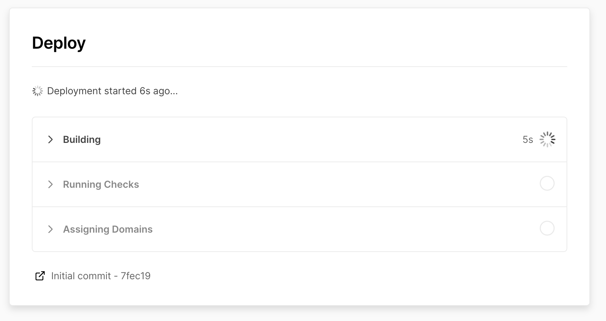
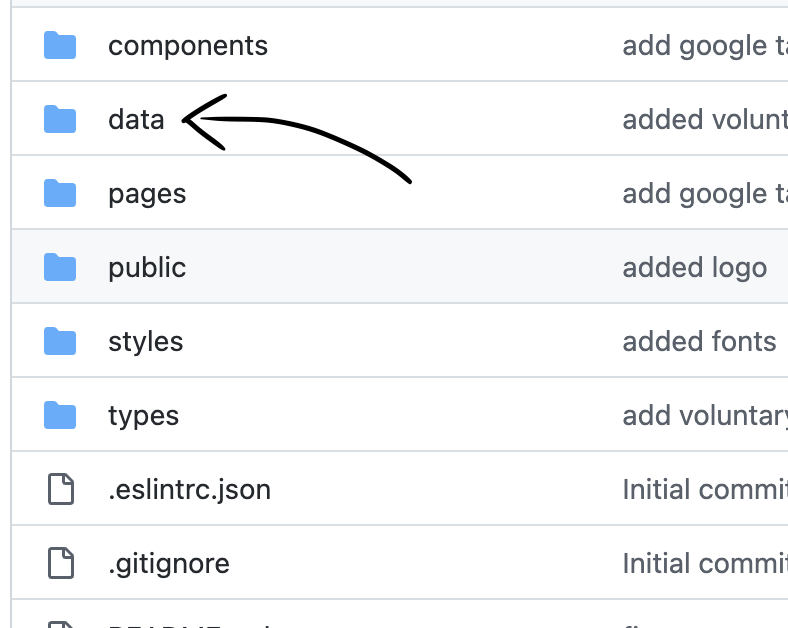
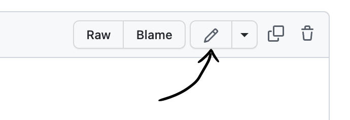

# La Crypta Links

Create your own custom Linktr.ee like site.

## Features

- [x] Netlify Button
- [x] Vercel Button
- [x] Links config
- [x] Title and Page config
- [x] Editable Logo
- [ ] Animations on load
- [ ] Editable Background
- [ ] Editable Colors
- [ ] Editable Fonts

---

### Recommended way (updates available)

- Fork this repo
- Import it from your **Vercel** or **Netlify** account.
- Edit **/data/links.json**

# For dummies Way:

### Click for Vercel or Netlify (Both Free)

[](https://vercel.com/new/clone?repository-url=https%3A%2F%2Fgithub.com%2Flacrypta%2Flinks&project-name=my-links&repository-name=links&demo-title=La%20Crypta%20Links&demo-description=Oficial%20links%20for%20La%20Crypta&demo-url=https%3A%2F%2Flinks.lacrypta.ar%2F)

or

[](https://app.netlify.com/start/deploy?repository=https://github.com/lacrypta/links)

And follow the steps for deployment

### Wait for the deploy to finish

> It might take about **1:30 seconds**

<p align="center">

</p>

## Go to your repo in Github

<p align="center">

</p>

> _USERNAME_ must be your Github username

### Edit Configuration file

Edit file in **/data/links.json**

- Click on **data** directory
<p align="center">

</p>

- Click on **data** directory and then on **links.json**

- Click on **Edit icon** on the top-right corner.

<p align="center">

</p>

- Edit the file with your own **Social data**.

- Commit changes

<p align="center">

</p>

---

## Local Development

First, run the development server:

```bash
yarn dev
```

Open [http://localhost:3000](http://localhost:3000) with your browser to see the result.
